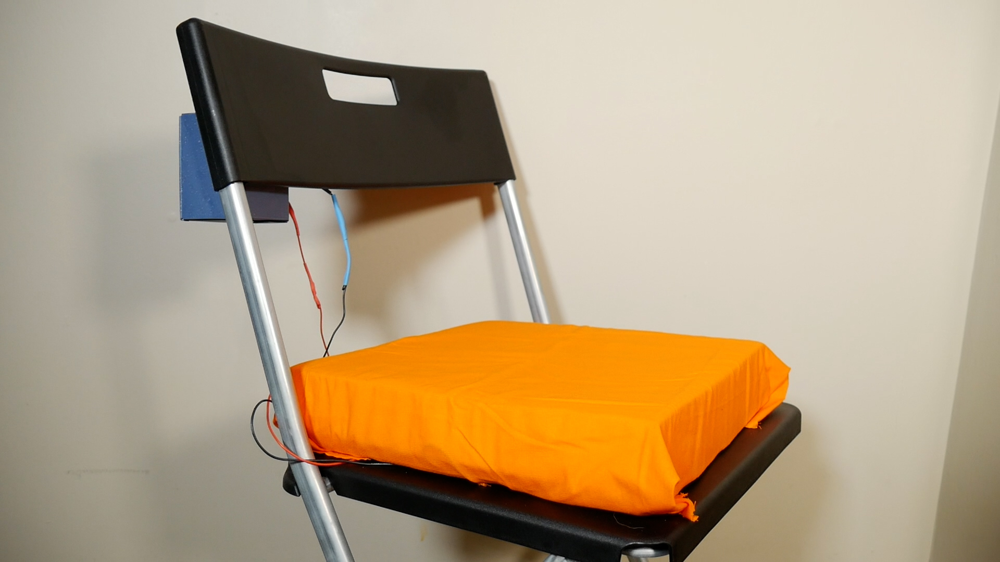

# Prolonged Sitting Alarm
An arduino powered smart cushion that sounds an alarm after 30 minutes of sitting. The alarm will keep rining until you stand up. You must wait a full minute before you sit back down or else the alarm will continue to go off again.

[YouTube Video](https://www.youtube.com/watch?v=lPFiY0v1rcI)

## Why
Because sitting for long periods of time without any breaks is not good for your overall health

## How it works
The cushion contains a layer of [velostat](https://www.amazon.com/gp/product/B071G74PGW/ref=ppx_yo_dt_b_search_asin_title?ie=UTF8&psc=1). Velostat is conductive but has a resistance that decreases when pressure is applied to it. Using that information, we know that a change in resistance will affect the change in voltage (Ohm's law). So we connect this to a voltage divider and feed that to a comparator to compare agaisnt some stable voltage.

On the microcontroller, we poll this circuit every 8 seconds (the max time we can use the watchdog timer to sleep). Everytime someone is sitting we mark it as a hit. After 225 hits in a row (225 * 8 = 1,800 seconds which is 30 minutes), the buzzer goes off. If nobody is sitting, then it's a miss. After 7 misses in a row (7*8 = 56 seconds) we reset all the counters back to zero.

## Is it useful?
Yes! I've been dogfooding my gadget, and it's amazing to see how often the alarm goes off when I didn't even notice 30 minutes have went by. Especially during gaming, when I can sit for hours without getting up.